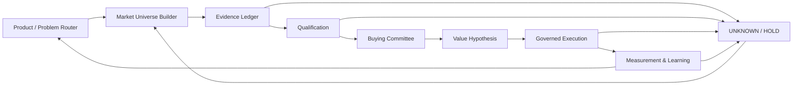

# OnistAgentWorkflow

**Account-to-Opportunity Sales Intelligence Agent — certified dry-run reference workflow + reusable agent skill.**

> 中文：这是一个把“产品/场景定义 → 市场找公司 → 公司背调 → Fit/Pain/Intent/Timing 判断 → Buying Committee → 价值假设 → 受控触达 → CRM/销售结果 → 因果测量 → 受控学习”串成闭环的 Agent Workflow。

This repository is the reviewed implementation blueprint derived from a staged design/review process. It is designed for B2B prospecting and sales intelligence, with two reference domains:

- **Industrial 3D printing**
- **CLO Virtual Fashion family**: CLO, Marvelous Designer, CLOFAB/zFab, CLO-SET

## Trade Acquisition Loop(外贸获客闭环)

v1.0 adds a governed trade-acquisition loop on top of the certified spine — 时机触发式目标筛选、渠道/人员定位、Email/LinkedIn/WhatsApp 触达信、跟进与约会议状态机、可重复 benchmark:

- Skill: [`skills/trade-acquisition-loop/SKILL.md`](skills/trade-acquisition-loop/SKILL.md) (modes: research-timing / channel-persona / draft-outreach / follow-up / meeting-book / eval-loop)
- Business loop doc: [`docs/trade-acquisition-loop.md`](docs/trade-acquisition-loop.md)
- Contracts: `contracts/timing-trigger-taxonomy-v1.0.json`, `contracts/outreach-channel-policy-v1.0.json`, `contracts/followup-meeting-state-machine-v1.0.json`
- Runtime + benchmark: `workflow/acquisition.py`, `examples/trade-acquisition-benchmark.json`, `tests/test_trade_acquisition.py`

## What “certified” means here

`CERTIFICATION.md` is an **internal engineering certification gate**, not an external legal, regulatory, or third-party certification. A release is certified only when the deterministic workflow tests, contract checks, cross-stage lineage checks, and safety gates pass in CI.

## Core workflow



## Design principle

**Wide early, strict late.**

- Discovery optimizes recall and source diversity.
- Evidence verification optimizes precision, provenance, contradiction handling and freshness.
- Qualification uses hard gates before ranking.
- Buying committee routing separates job title, organizational scope, buying role and personal intent.
- Persuasion separates `FACT -> HYPOTHESIS -> MECHANISM -> PROOF -> QUESTION -> PROPOSAL`.
- Execution separates recommendation, permission and side effects.
- Learning separates account truth, attribution, causal evidence and global policy release.

## Repository structure

```text
workflow/                       executable deterministic reference runtime + acquisition sub-machine
skills/account-to-opportunity/  reusable SKILL.md + references
skills/trade-acquisition-loop/  外贸获客闭环 skill + 渠道模板 references
contracts/                      stage, handoff, channel, cadence and trigger contracts
examples/                       industrial-3DP and CLO dry-run artifacts + acquisition benchmark
tests/                          certification tests
docs/                           final architecture, implementation plan and acquisition loop
.github/workflows/              CI certification gate
PROJECT.md                      canonical durable project state
cache/recovery-packet.md        resumable handoff state
CERTIFICATION.md                certification scope and gate
```

## Quick start

```bash
python workflow/runtime.py --demo
python workflow/acquisition.py --demo
python -m unittest discover -s tests -v
```

The reference runtime is intentionally **dry-run first**. It enforces state, lineage, hold/reject branches, reply interrupts, idempotency semantics and learning-release gates without requiring live CRM/email/search credentials.

## Production boundary

Live external actions remain blocked until these are explicitly configured and reviewed:

1. target jurisdiction / recipient class / channel policy;
2. seller legal entity and sender domain/provider;
3. CRM write scope and account ownership rules;
4. suppression / opt-out / privacy process;
5. industrial 3DP technical envelope for the actual printer portfolio;
6. business metric semantics and sales-cycle horizons;
7. experiment assignment and contamination controls.

See [`docs/architecture.md`](docs/architecture.md), [`workflow/WORKFLOW.md`](workflow/WORKFLOW.md), and [`skills/account-to-opportunity/SKILL.md`](skills/account-to-opportunity/SKILL.md).
