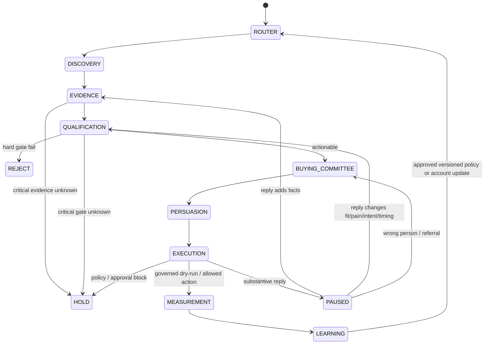

# Final Architecture — Account-to-Opportunity Agent Workflow v1.0

## 1. System objective

Turn open-world market information and product/use-case definitions into traceable sales actions and measurable business outcomes:

`Product -> Candidate Account -> Evidence -> Qualification -> Buying Committee -> Value Hypothesis -> Governed Action -> Funnel Outcome -> Controlled Learning`

The architecture deliberately avoids a single autonomous “super-agent”. The recommended production shape is:

> **Durable deterministic workflow backbone + bounded agentic reasoning nodes + governed data/evidence services + human/policy gates + dual evaluation + versioned learning.**

## 2. Logical components

### Workflow Orchestrator — deterministic
Owns state transitions, retries, checkpoints, branch decisions, immutable artifact references and resumability. It must not invent business facts.

### Product / Problem Router — bounded agentic + rules
Maps product adapters to jobs-to-be-done and observable signal families. Multi-label by design: one company may route to CLO, CLO-SET and CLOFAB simultaneously.

### Market Universe Builder — search-heavy agent
Expands source families and query axes for high-recall candidate discovery. Output is candidate seeds, never qualified accounts. Open-world runs must preserve `OPEN_WORLD_NOT_COMPLETE` semantics.

### Entity + Evidence Service — mixed deterministic/agentic
Resolves companies/brands/subsidiaries and converts sources into atomic claims with provenance, original-source grouping, event time, freshness, contradiction and support status. `UNKNOWN`, `NOT_FOUND_AFTER_COVERAGE` and `NEGATIVE_VERIFIED` are different states.

### Qualification Engine — mostly deterministic policy
Consumes frozen evidence-ledger versions. Keeps Fit, Pain, Intent, Timing, Capacity/Strength, Buyer Value and Seller Value separate. Hard gates are non-compensable. Output is an action class, not an uncalibrated purchase probability.

### Buying Committee Agent — bounded agentic + evidence gates
Builds a role graph for the current sales goal. Job title != buying role != authority != personal intent. Multi-threading means distinct decision-role coverage, not “more people”.

### Value Hypothesis Agent — bounded agentic under epistemic contract
Produces a `ValueHypothesisPacket` using `FACT -> HYPOTHESIS -> MECHANISM -> PROOF -> QUESTION -> PROPOSAL`. External case-study ROI is proof of mechanism, never a promised target-account result.

### Execution Policy + Dispatcher — deterministic
Checks suppression, jurisdiction, sender readiness, account ownership collision, approval, idempotency and current sequence state before any side effect. A provider-uncertain send is reconciled, never blindly retried.

### Event / Measurement Service — deterministic + analytics
Normalizes delivery, reply, meeting, opportunity, stage, won/lost and guardrail events. CRM attribution is lineage, not causal incrementality.

### Learning / Release Controller — deterministic gate + evaluation
Separates account fact update, eval correction, safety/correctness fix, routing/ranking optimization and persuasion/sequence optimization. Performance-policy promotion requires offline eval plus the causal/business evidence defined by the learning-release policy, with rollback.

## 3. Logical stores

- Operational state store — workflow state, IDs, locks, idempotency keys.
- Evidence store — accounts, entity graph, atomic claims, source/evidence edges, freshness and contradictions.
- Artifact/object store — immutable stage payloads with hash/version.
- CRM adapter — bounded account/contact/opportunity read/write operations.
- Event ledger — outreach and funnel events, experiment assignment, reply taxonomy.
- Eval dataset — corrected traces and regression fixtures.
- Policy registry — versioned qualification, execution and learning policies plus rollback target.

Vendor choice is intentionally not locked at design time.

## 4. Runtime state machine

## 5. Canonical cross-stage identity

Every durable artifact must preserve `account_id`, `product_adapter_id`, `artifact_id`, `artifact_version`, `content_hash`, and `created_at`. Later stages add contact, action, sequence, execution trace, event, experiment and policy identifiers. A production action must be reconstructable back to the exact evidence version and decision artifacts that authorized it.

## 6. Stage hard gates

- Discovery: no fake market completeness, unauthorized source access, or candidate-as-qualified shortcut.
- Evidence: no wrong entity merge, unsupported decision claim, or not-found-as-negative.
- Qualification: hard gates cannot be score-compensated; no fake calibrated probabilities.
- Buying committee: account intent cannot become personal intent; title alone cannot prove authority.
- Persuasion: no borrowed ROI, invented target pain, or epistemic-label upgrade by a renderer.
- Execution: unknown jurisdiction blocks live action; suppression cannot be bypassed; no blind retry; substantive replies pause automation.
- Measurement/Learning: attribution != causal lift; C0/C1 cannot promote performance optimization; failed data quality blocks causal learning; rollback required for global policy changes.

## 7. Agent vs deterministic boundary

Use an LLM/agent where the job is fuzzy, language-heavy, open-world or hypothesis-generating. Use deterministic code/policy where the job is authorization, identity continuity, suppression, state transition, replay safety, hard gates, event joins, experiment assignment or policy promotion. This boundary is more important than the choice of agent framework.

## 8. Reference product adapters

### Industrial 3D printing
Jobs: prototypes, tooling/jigs/fixtures, rapid tooling, high-mix low-volume, replacement parts. Production qualification additionally needs the actual printer technical envelope: process, material, build volume, throughput, accuracy, environment, certification, price and service region.

### CLO family
- `CLO_FASHION_DPC`: apparel design / sampling / product development.
- `MD_CG_CLOTH`: game/VFX/animation/CG clothing asset workflow.
- `CLOFAB_FABRIC_DIGITIZATION`: textile/fabric digitization and digital-material workflow.
- `CLOSET_3D_WORKSPACE`: 3D asset/version/review/collaboration/product-lifecycle workspace.

## 9. First production pilot

Start read-only/propose-only: select one territory and one adapter, build a known-positive benchmark, discover a bounded account cohort, research/qualify it, human-review committee/value outputs, and measure seller corrections. Enable one-to-one external execution only after deployment policy is ready. When testing persuasion/routing, prefer account × product assignment and do not promote global policy from single-case success.

## 10. Production readiness gate

Live deployment is not ready until jurisdiction, seller entity, recipient class, sender infrastructure, CRM write scope, suppression/privacy process, ownership collision policy, product technical envelope, metrics, outcome horizon and experiment topology are resolved and reviewed.
