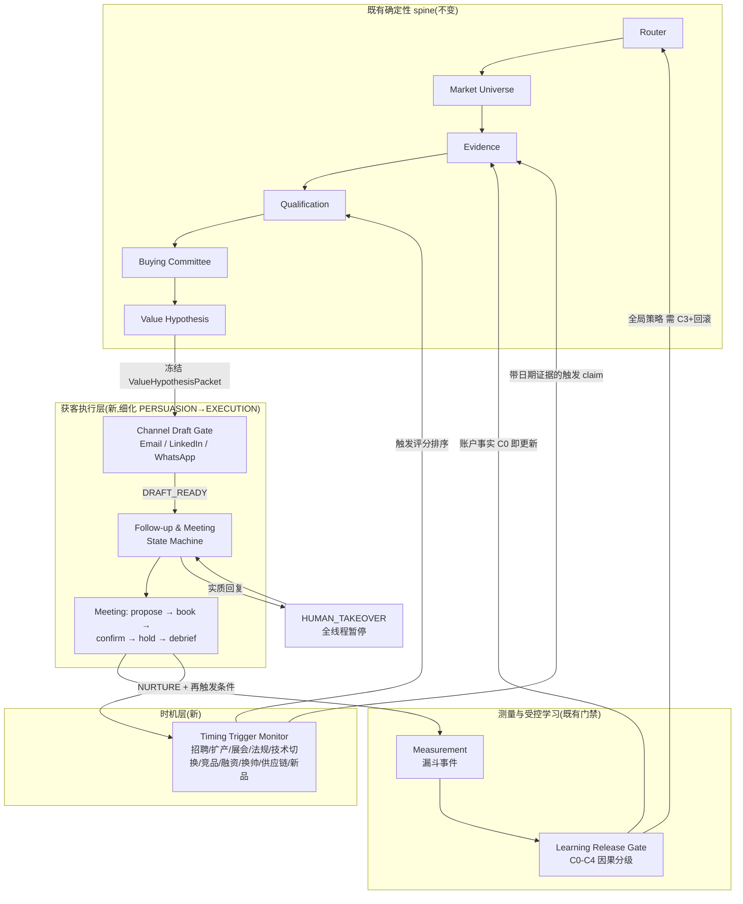

# 外贸获客闭环(Trade Acquisition Loop)v1.0

本文档定义 OnistAgentWorkflow 的外贸客户获取业务闭环:从"什么时候找哪些公司"到"会后下一步",全部落在既有确定性 spine 上,可 dry-run、可 eval、可多轮 benchmark。

规范产物:
- Skill:`skills/trade-acquisition-loop/SKILL.md`(模式:research-timing / channel-persona / draft-outreach / follow-up / meeting-book / eval-loop)
- 合约:`contracts/timing-trigger-taxonomy-v1.0.json`、`contracts/outreach-channel-policy-v1.0.json`、`contracts/followup-meeting-state-machine-v1.0.json`
- 运行时:`workflow/acquisition.py`;基准:`examples/trade-acquisition-benchmark.json`;测试:`tests/test_trade_acquisition.py`

## 1. 完整闭环



闭环语义:每一轮运行产生的**账户事实**(交期、预算周期、角色图修正)立即回写证据台账;**话术/节奏/渠道顺序的全局改动**必须走 learning-release 因果门禁;NURTURE 的账户登记"再触发条件",由时机层监控到期唤醒,而不是盲目重发。

## 2. 获客与触达策略

### 2a. 调研与目标筛选:什么时候找哪些公司

原则:**触发优先(trigger-first)**。静态 ICP 决定"可能是谁",触发事件决定"现在找谁"。

1. **市场级**:按 adapter 的 jobs-to-be-done 构建 universe(复用 `universe-discovery-policy`,open-world 语义、多源族、禁伪完备)。
2. **时机级**:十个触发族(见 `contracts/timing-trigger-taxonomy-v1.0.json`)持续监控;每个触发必须成为带日期、带来源的证据 claim。
3. **公司级**:进入外呼队列前,公司档案五项齐全(实体身份 / 业务契合 / 时机触发 / 可触达角色 / 辖区)且全部 SUPPORTED+source——由 `evaluate_evidence_completeness` 校验。
4. **评分**:`score = Σ(触发权重 × 新鲜度)`;≥0.8 现在外呼,0.5–0.8 探索性触达,<0.5 监控养育。触发分永远不能翻转资格硬门禁。

### 2b. 渠道与人员定位

- 角色来自 Buying Committee 阶段;首选 PROBLEM_OWNER / PRACTITIONER_USER 验证 pain,证据强时才直触 ECONOMIC_BUYER。
- 渠道按角色映射(`persona_channel_priority`):工程/评估角色 Email 优先,一线从业者与高管 LinkedIn 优先,采购只走 Email。
- WhatsApp 是**延续渠道**(展会/转介绍/明示同意后),冷启动被代码门禁禁止。
- 并行多线程 ≤3 且角色互异;任一线程实质回复,整个 account × product 暂停。
- 区域适配(时区、称谓、工作周、假期季)见 `skills/trade-acquisition-loop/references/persona-channel-map.md`。

### 2c. 触达信撰写

所有渠道共享同一冻结的 ValueHypothesisPacket,渲染规则:

| 渠道 | 长度 | 结构 | 关键禁令 |
|---|---|---|---|
| Email T1 | ≤120 词 | FACT→HYPOTHESIS→MECHANISM/PROOF→QUESTION→PROPOSAL 六句结构 | ROI 承诺、Dear Sir、虚假熟络、占位符残留 |
| LinkedIn | 备注 ≤300 字符 / 消息 ≤500 字符 | 角色相关理由→具体观察→低承诺问题 | 首条带链接、首条 pitch、自动化发送 |
| WhatsApp | ≤60 词 | 身份+锚点→一句 FACT→一个问题 | 无 consent 冷发、首条链接/emoji |

逐句模板、好/坏例子、T1–T4 差异、约会议话术:见 `skills/trade-acquisition-loop/references/` 三个渠道模板文件。所有草稿必须通过 `ChannelDraftGate`(违规=拒绝,不是警告)。

## 3. 跟进与转化流程

### 3a. 跟进流程

`DRAFT_READY → SENT → OPENED/NO_REPLY → FOLLOWUP_1..3 → NURTURE`,全局中断 `reply_substantive → HUMAN_TAKEOVER`、`opt_out → UNSUBSCRIBED`、`bounce/policy → HOLD`。

- 节奏:day 0 / +3 / +7 / +14;间隔 ≥3 天;每序列 ≤4 触点(第 4 触点=收尾信,进 NURTURE)。
- 每个触点必须带新信息;T3 自带转介绍出口;T4 留价值资产并明确停止。
- 换渠道:同渠道 2 次无回复后;换人:序列耗尽或转介绍,且必须换 buying role,90 天 ≤2 次。
- 实质回复 → 全线程暂停 → 人工 1 个工作日内分类 → 回复内容写回证据台账。

### 3b. 约会议流程

`MEETING_PROPOSED → MEETING_BOOKED → MEETING_CONFIRMED → MEETING_HELD → QUALIFIED_OPPORTUNITY / NURTURE / CLOSED_LOST`

- 请求:收件人时区 2 个时段 + 20–25 分钟 + 一句话议程 + 双方角色;无回应只提醒一次(48–72h)。
- 确认包七项(议程/双方角色/时区/时长/链接/证据摘要/T-24h 再确认)缺一不可,代码强制。
- No-show 不指责、当天重约,累计 ≤2 次。
- 会后 24h debrief 三件套(笔记入台账 / 回复分类 / 下一步)缺一不可;三出口各有明确后续:商机交接、登记再触发、挂原因关单。
- 异议处理六分支(先发资料/时机不对/已有供应商/没预算/找错人/明确拒绝)见 playbook。

## 4. 指标与学习回路

漏斗事件由状态机自然产生:`touch_sent → open → reply_substantive → meeting_booked → meeting_held → qualified_opportunity`,加守护指标:`opt_out 率、bounce 率、violations_blocked`。

学习分层(复用 learning-release-policy):
1. **账户层(C0 即可)**:会议确认的事实、回复中的信息 → 立即更新账户记忆。
2. **假设层(C1)**:触发族×模板×角色的转化率关联 → 只能形成待验假设。
3. **策略层(C2/C3)**:话术/节奏/渠道顺序的全局改动 → canary 需 C3,broad 需 C3+复现,且 offline eval、guardrails、rollback 齐全。`check_policy_promotion` 代码强制。

A/B 语义:随机化单元是 account × product(联系人级随机会互相污染同一商机),对齐 `causal-evidence-grades` 的既有规则。

## 5. Eval / Benchmark(可重复跑)

`examples/trade-acquisition-benchmark.json` + `tests/test_trade_acquisition.py`:

| 维度 | 校验 | 机制 |
|---|---|---|
| 市场调研 | 已知阳性召回 ≥0.75、源族 ≥4、禁伪完备声明 | `evaluate_discovery_benchmark` |
| 公司调研 | 五项决策 claim 齐全(SUPPORTED+source) | `evaluate_evidence_completeness` |
| 时机筛选 | 触发评分三档推荐正确、无日期触发被拒 | `score_timing_triggers` |
| 渠道合规 | 14 个草稿 fixture 按标签 PASS/FAIL(ROI、长度、consent、链接、时窗、占位符) | `ChannelDraftGate` |
| 状态机合法性 | 非法转移、提前跟进、超量触点、无确认包、无 debrief、终态事件全部被拒 | `FollowUpStateMachine` |
| 循环可重复 | 3 轮 × 2 线程脚本,双跑哈希一致;违规探针被拦截且计数 | `AcquisitionLoopRunner` |
| 学习门禁 | C0 单次成功不能晋升全局;C3 canary 可;broad 需复现 | `check_policy_promotion` |

命令:

```bash
python -m unittest discover -s tests -v      # 全套认证(含既有 21 项)
python workflow/acquisition.py --demo        # 集成演示:spine + 获客子状态机到 QUALIFIED_OPPORTUNITY
```

## 6. 生产边界(不变)

本闭环全部产物默认 dry-run。真实外发前仍需解析 `PROJECT.md` 的生产阻塞项:辖区/收件人类别、发件域与送达基建、CRM 写权限、抑制/隐私流程、技术封套、指标语义、实验拓扑。WhatsApp Business 模板预审与 LinkedIn 人工执行约束是本闭环新增的部署级要求。
